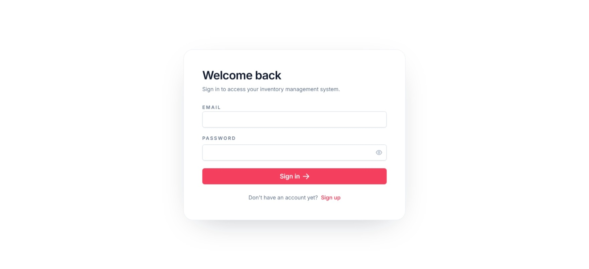
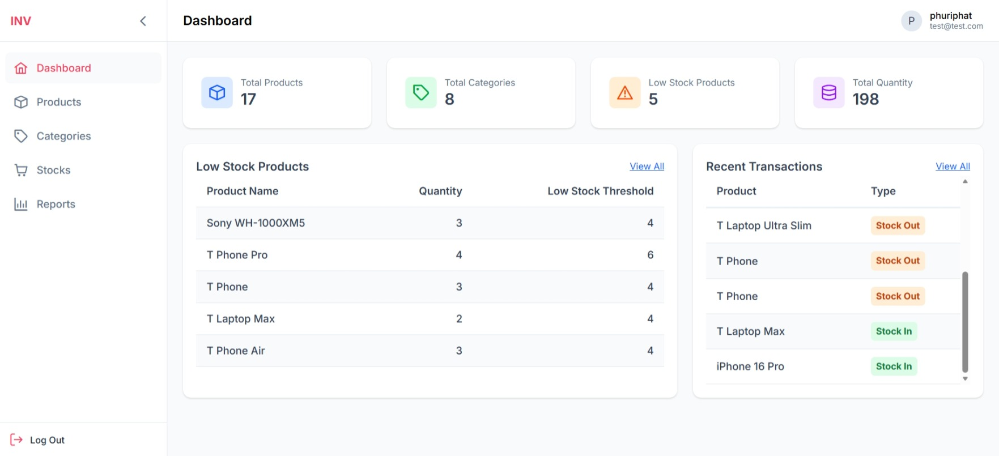
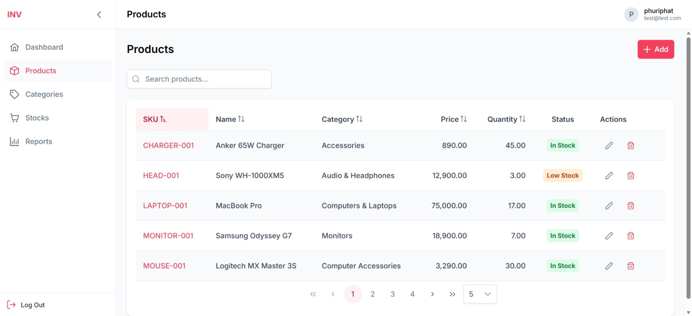
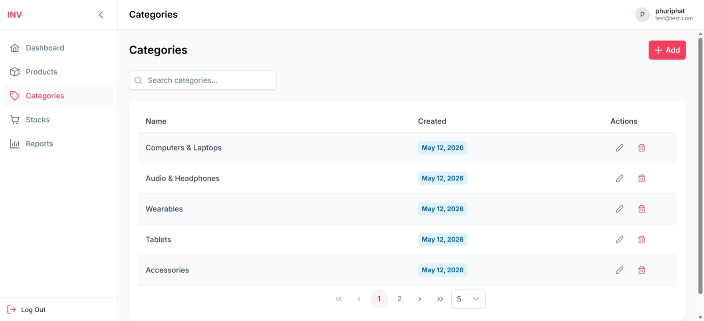
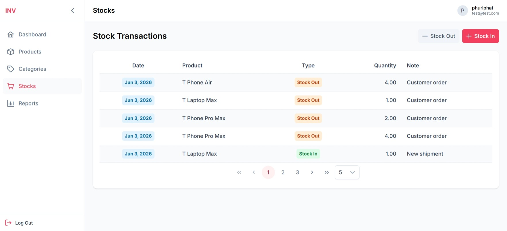

# Inventory Management UI

Inventory Management UI built with Angular.

## Screenshots

### Login Page



### Dashboard



### Product Management



### Category Management



### Stock Transactions



## Features

### Authentication

- JWT Authentication
- Login & Register
- Route Guards
- HTTP Interceptors
- Protected Routes

### Dashboard

- Inventory Summary Cards
- Low Stock Monitoring
- Recent Stock Transactions

### Product Management

- Product Listing
- Product Search
- Product Details & Stock Tracking
- Pagination
- Sorting
- Create Product
- Edit Product
- Delete Product

### Category Management

- Category Listing
- Category Search
- Pagination
- Create Category
- Edit Category
- Delete Category

### Stock Management

- Stock In
- Stock Out
- Transaction History
- Pagination

### Reporting

- Low Stock Products

### User Experience

- Responsive Design
- Loading States
- Empty States
- Toast Notifications
- Confirmation Dialogs
- Form Validation

## Tech Stack

### Frontend

- Angular
- TypeScript
- RxJS
- Angular Router
- Reactive Forms
- PrimeNG
- Tailwind CSS

### Backend

- Spring Boot
- Spring Security
- JWT Authentication

### Database

- PostgreSQL

## Architecture

```text
┌─────────────────┐
│ Angular UI      │
└────────┬────────┘
         │ REST API
         ▼
┌─────────────────┐
│ Spring Boot API │
└────────┬────────┘
         │
         ▼
┌─────────────────┐
│ PostgreSQL      │
└─────────────────┘
```

## Project Structure

```text
src/app
├── core
│   ├── auth
│   ├── guards
│   ├── interceptors
│   ├── layouts
│   └── services
│
├── shared
│   ├── components
│   ├── types
│
├── features
│   ├── auth
│   ├── categories
│   ├── dashboard
│   ├── not-found
│   ├── products
│   ├── reports
│   └── stocks
│
└── app.routes.ts
```

## API Integration

This frontend application consumes a Spring Boot REST API for:

- Authentication
- Product Management
- Category Management
- Stock Transactions
- Dashboard Statistics

## Getting Started

### Prerequisites

- Node.js 22+
- npm 10+
- Angular CLI
- Running backend API → [inventory-api](https://github.com/prxsss/inventory-api)

### Clone Repository

```bash
git clone https://github.com/prxsss/inventory-ui.git
cd inventory-ui
```

### Install Dependencies

```bash
npm install
```

### Configure Environment

Create `src/environments/environment.ts`:

```typescript
export const environment = {
  apiUrl: 'http://localhost:8080/api',
};
```

### Start Development Server

```bash
ng serve
```

Application will be available at:

```text
http://localhost:4200
```

## Production Build

```bash
ng build
```

Build output:

```text
dist/
```

## Future Improvements

- Role-Based Access Control (RBAC)
- Export Reports (CSV/PDF)
- Advanced Filters
- Audit Logs
- Inventory Analytics Dashboard
